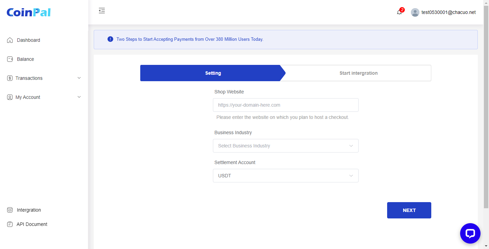
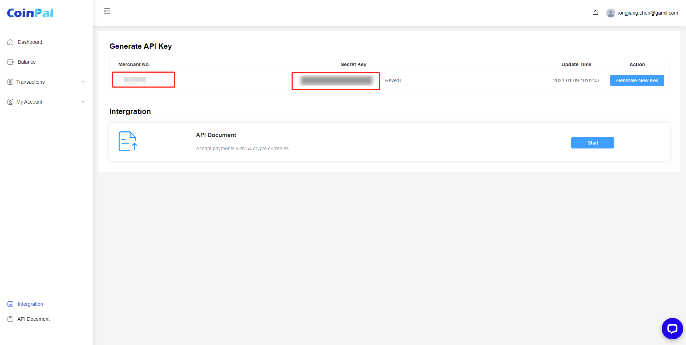

# PrestaShop CoinPal Checkout Installation

## Step 1: Log in to the CoinPal Admin Dashboard to get the Merchant Number and Secret Key.
1. [Register](https://portal.coinpal.io/#/admin/register)/[login](https://portal.coinpal.io/#/admin/login) and go to CoinPal's Admin Dashboard 

2. Follow the Dashboard guidelines to fill in the relevant information

3. Click the 'Integration' button in the lower left corner to get the corresponding Merchant Id and Secret Key

## Step 2: Installing the CoinPal Plugin on your PrestaShop Site.
1. Click on the [Coinpal plugin](https://github.com/coinpal-io/plug_prestashop/blob/master/coinpalpayment.zip) to download the CoinPal PrestaShop Payment Plug.

2. Navigate to your PrestaShop admin area and follow this path: Module -> Module Management -> Upload Module

3.  Configure CoinPal PrestaShop Gateway

    Go to the PrestaShop Admin, click Configuration.
        
    Copy and Paste all of the Settings you generated in your CoinPal Dashboard on Step #1.
    
    Click Save Changes.

## Step 3: Testing your Coinpal PrestaShop Integration.

To confirm your Integration is properly working create a test order:

Add a test item to your shopping cart and view the cart.

Proceed to Checkout

Select CoinPal as the Payment Method.

Click PLACE ORDER

Verify all of the Wallet Addresses and Order info, and make sure the Validation Tests all have a Green Check Mark.

If you like you can now proceed to making a test payment.

## Step 4: Marking a Payment as Received on PrestaShop.

Login to your PrestaShop Admin Dashboard.

Go to the PrestaShop Section and Click Orders.

You will see the test orders marked as "Paid".

Check whether coins are settled to the CoinPal wallet.

You may also use a Block Explorer to verify if the transaction was processed.

After the verification of the above steps is completed, it means that the connection with CoinPal is successful.

